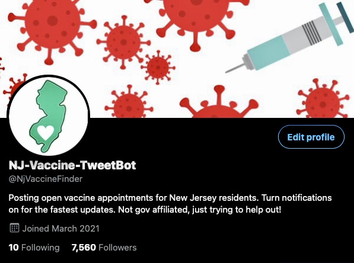

# NJ Covid Vaccine Tweetbot
## **Follow [@NjVaccineFinder](https://twitter.com/NjVaccineFinder) on Twitter**

_____________________________________________________

**Disclaimer**: The goal of this project is to help people in NJ find covid vaccine appointments. We use the bot to notify followers that appoinments are ***available*** we do NOT schedule appointments for anyone. We do not condone people attempting to use bots to register for appointments.

We have decided to leave this repo public so people can adapt this for different states or anywhere else in the world. We are trying to help get as many people vaccinated as possible, we strongly encourage people who are capable to volunteer and help those who dont have access to technology get their shot. 

_____________________________________________________

### **Currently in use**
    Rite Aid - Data can be inconsistent, but this is one of the most popular pharmacies in the state. Many available appointments throughout the day, all different types of vaccines listed.

    CentraState - Form opens irregularly but we can consistantly catch when it is open, the site is run well and people will reach out to anyone who signs up within a day or two.

    VNACJ - We have this working well, working on counting all open appointments at multiple locations. This opens a few times per week.
_____________________________________________________
### **Being Updated**
    Costco - Just opened for the first time, we are working on it.

    Rowan -  Appointments are sitting for a while now, too many tweets.

    Freehold - Rarely has new appointments.

    Brookdale - It works but can be hit or miss when the portal is actually opened. We will try to combine using the API endpoints and Selenium to make sure the portal is open before alerting that appointments are available.
_____________________________________________________
### **Decommissioned**
    Acme -  Data is inaccurate, we only ran it a few times but we advise against using it. They have a link to signup for notifications on their site, we advise users to do that.

    CVS -  Other bots do it better, we are focusing on other locations.

    HMHN - Site switched to pre registration.
